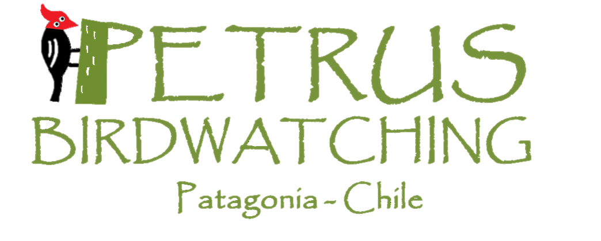

# Proyecto final: Petrus

- Nombre del proyecto: Petrus Birdwatching

- Descripción breve del proyecto: Página para dar a conocer el trabajo que ofrece mi hermano para el turismo regional en la Patagonia Chilena.

- Estrategia:
	- ¿Quiénes son los usuarios? : 
	- ¿Cuál debería ser la conversión de éstos? :

- Wireframe de las principales vistas del proyecto.

- Breve guía de estilo:
	- Colores a utilizar:
	- Tipografías a utilizar:
	- Identificador gráfico (logotipo, isotipo):

			
